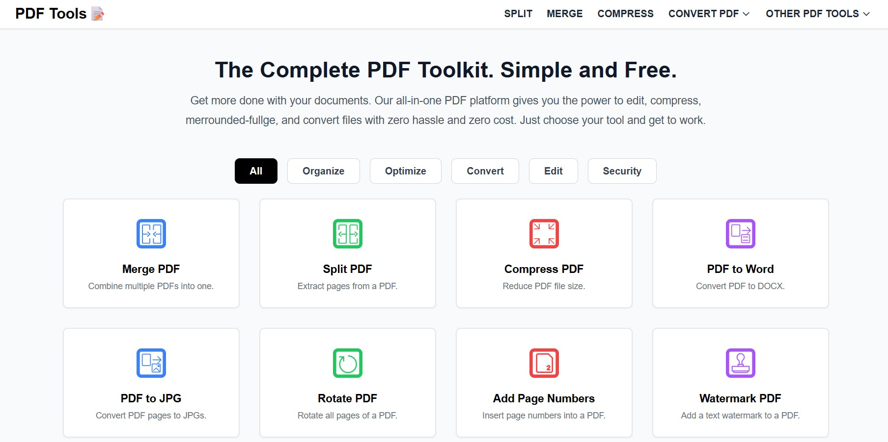

# PDF Tools

A web-based application that provides various tools for PDF manipulation.

## Features

*   **Merge PDFs:** Combine multiple PDF files into a single document.
*   **Compress PDF:** Reduce the file size of a PDF.
*   **PDF to JPG:** Convert each page of a PDF into a JPG image.
*   **Split PDF:** Extract a range of pages from a PDF.
*   **Rotate PDF:** Rotate all pages of a PDF by a specified angle.
*   **Add Page Numbers:** Add page numbers to each page of a PDF.
*   **Add Watermark:** Add a text watermark to each page of a PDF.
*   **Unlock PDF:** Remove the password from a password-protected PDF.
*   **PDF to Word:** Convert a PDF file into an editable Word document.
*   **User Authentication:** Secure user registration and login system.

## Screenshots

**Home Page**  


**Merge PDFs**  


## Installation

1.  **Clone the repository:**
    ```bash
    git clone <repository-url>
    cd pdf_tools_modular
    ```

2.  **Create a virtual environment and activate it:**
    ```bash
    python -m venv venv
    source venv/bin/activate  # On Windows, use `venv\Scripts\activate`
    ```

3.  **Install the dependencies:**
    ```bash
    pip install -r requirements.txt
    ```

## Usage

1.  **Run the application:**
    ```bash
    python run.py
    ```

2.  Open your web browser and navigate to `http://127.0.0.1:5000`.

3.  **Register or log in** to your account.

4.  Select the desired **PDF tool** from the main page.

5.  **Upload your file(s)** and provide any required options.

6.  **Download** your processed file.

